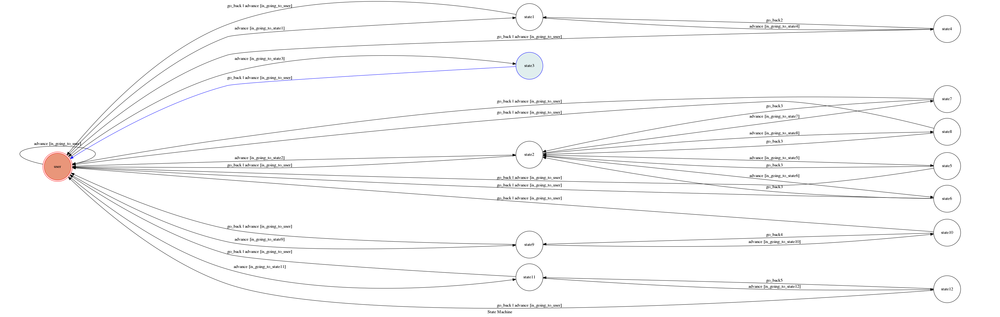

# TOC Project 2017

TOC Project 2017 by chen841115

A telegram bot based on a finite state machine

## Author
[chen841115](https://github.com/chen841115)
NCKU CSIE 蕭丞志 F74031093 

## Finite State Machine



## 用途
*一個聊天機器人，可以取得與股票有關的資訊。

## 用法
*最初的stage在user stage。
*有五個選擇，直接輸入：大盤/股價/股票建議/國際股市/休市日期
    *大盤
        *輸出台股大盤資訊，包含指數漲幅跌資訊。
    *股價
        *進入另一個stage，可以輸入台灣的股票代碼，會輸出此股票資訊。
    *股票建議
        *進入另一個stage，可以輸入四種特性：爆量長紅/瞬間暴漲/爆量長黑/瞬間暴跌，會找出最近五檔有此特性的股票。
    *國際股市
        *進入另一個stage，可以輸入國際股市名稱(ex道瓊:NAS/道瓊:DJI)，會輸出此國際指數資訊。
    *休市日期
        *進入另一個stage，可以輸入地區，會輸出此地區的休市日期。

### Prerequisite
* Python 3

#### Install Dependency
```sh
pip install -r requirements.txt
```

* pygraphviz (For visualizing Finite State Machine)
    * [Setup pygraphviz on Ubuntu](http://www.jianshu.com/p/a3da7ecc5303)

### Secret Data

`API_TOKEN` and `WEBHOOK_URL` in app.py **MUST** be set to proper values.
Otherwise, you might not be able to run your code.

### Run Locally
You can either setup https server or using `ngrok` as a proxy.

**`ngrok` would be used in the following instruction**

```sh
ngrok http 5000
```

After that, `ngrok` would generate a https URL.

You should set `WEBHOOK_URL` (in app.py) to `your-https-URL/hook`.

#### Run the sever

```sh
python3 app.py
```


